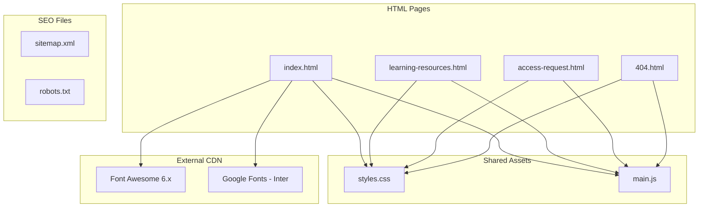
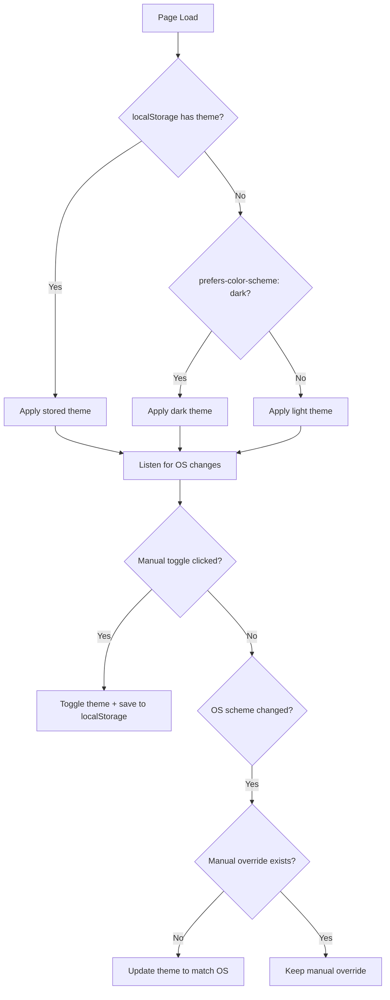
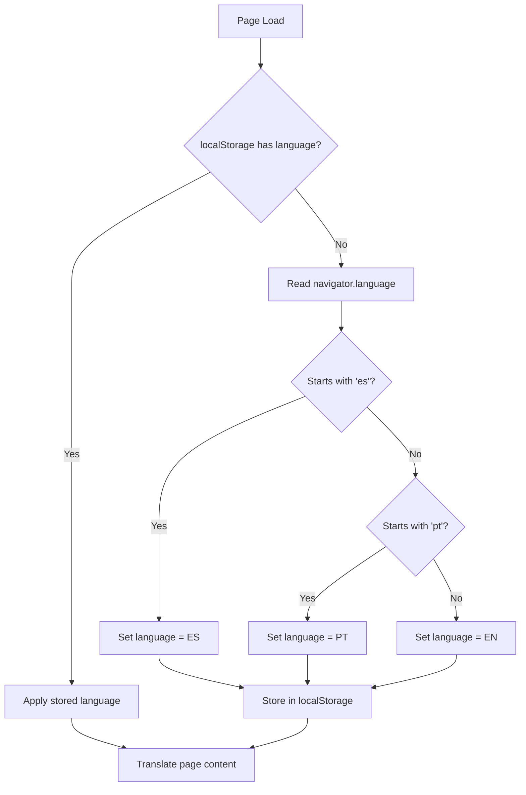

# Design Document: Portfolio Redesign

## Overview

This design describes the complete professional redesign of the Cloud DevOps Labs Index portfolio website. The site is a static site hosted on GitHub Pages with no build step — the repo root is deployed as-is. The redesign consolidates duplicated inline styles and scripts into shared external files, introduces a cohesive design system via CSS custom properties, adds automatic theme detection and locale detection, implements a sticky navigation with mobile menu, scroll animations, SEO metadata, security hardening, and a custom 404 page.

The tech stack remains: HTML5, CSS3 with custom properties, Vanilla JavaScript (no frameworks or bundlers), and Font Awesome 6.x via CDN. No build tooling is introduced.

## Architecture

The site follows a simple static architecture with shared assets:



### Page Structure

Each HTML page follows this structure:

```
<!DOCTYPE html>
<html lang="en">
<head>
    <!-- Meta tags, OG tags, CSP, canonical URL -->
    <!-- Preconnect hints -->
    <!-- External CSS with SRI -->
    <!-- Font Awesome with SRI -->
</head>
<body>
    <a href="#main-content" class="skip-link">Skip to content</a>
    <nav class="navbar" role="navigation" aria-label="Main navigation">
        <!-- Sticky nav with hamburger menu -->
    </nav>
    <main id="main-content">
        <!-- Page-specific content -->
    </main>
    <footer>
        <!-- Footer content -->
    </footer>
    <script src="main.js" defer></script>
    <script>
        // Page-specific translation data only
        const PAGE_TRANSLATIONS = { ... };
    </script>
</body>
</html>
```

### Theme Detection Flow



### Locale Detection Flow



## Components and Interfaces

### 1. Design System (styles.css)

The shared stylesheet defines the entire visual language:

```css
/* Design tokens as CSS custom properties */
:root {
    /* Color palette - Light theme (default) */
    --color-primary: #0066cc;
    --color-accent: #ff9900;
    --color-bg: #f8f9fa;
    --color-surface: #ffffff;
    --color-text: #1a1a2e;
    --color-text-secondary: #555;
    --color-border: #e0e0e0;

    /* Typography */
    --font-family: 'Inter', 'Segoe UI', system-ui, sans-serif;
    --font-size-xs: 0.75rem;
    --font-size-sm: 0.875rem;
    --font-size-base: 1rem;
    --font-size-lg: 1.125rem;
    --font-size-xl: 1.5rem;
    --font-size-2xl: 2rem;
    --font-size-3xl: 2.5rem;

    /* Spacing scale */
    --space-xs: 0.25rem;
    --space-sm: 0.5rem;
    --space-md: 1rem;
    --space-lg: 1.5rem;
    --space-xl: 2rem;
    --space-2xl: 3rem;
    --space-3xl: 4rem;

    /* Borders and shadows */
    --radius-sm: 4px;
    --radius-md: 8px;
    --radius-lg: 12px;
    --radius-full: 9999px;
    --shadow-sm: 0 1px 3px rgba(0,0,0,0.08);
    --shadow-md: 0 4px 12px rgba(0,0,0,0.1);
    --shadow-lg: 0 8px 24px rgba(0,0,0,0.12);

    /* Transitions */
    --transition-fast: 150ms ease;
    --transition-base: 250ms ease;
    --transition-slow: 400ms ease;

    /* Layout */
    --max-width: 1200px;
    --nav-height: 64px;
}

/* Dark theme */
[data-theme="dark"] {
    --color-bg: #1a1b26;
    --color-surface: #24283b;
    --color-text: #c0caf5;
    --color-text-secondary: #9aa5ce;
    --color-border: #3b4261;
    --color-primary: #7aa2f7;
    --color-accent: #e0af68;
    --shadow-sm: 0 1px 3px rgba(0,0,0,0.3);
    --shadow-md: 0 4px 12px rgba(0,0,0,0.4);
    --shadow-lg: 0 8px 24px rgba(0,0,0,0.5);
}
```

Theme is applied via `data-theme` attribute on `<html>` rather than a class on `<body>`. This allows the theme to be set before body renders, preventing flash of wrong theme.

### 2. Theme Engine (in main.js)

```
ThemeEngine
├── init()              // Detect OS preference or load from localStorage, apply theme
├── toggle()            // Switch theme, persist to localStorage
├── applyTheme(theme)   // Set data-theme attribute on <html>
├── onOSChange(event)   // MediaQueryList change listener
└── getTheme() → string // Return current theme ('light' | 'dark')
```

Interface:
- `ThemeEngine.init()` — called on DOMContentLoaded
- `ThemeEngine.toggle()` — bound to theme toggle button click
- Listens to `matchMedia('(prefers-color-scheme: dark)')` change events

### 3. Locale Engine (in main.js)

```
LocaleEngine
├── init(pageTranslations)  // Detect locale or load from localStorage, translate
├── detectLocale() → string // Read navigator.language, map to 'en'|'es'|'pt'
├── setLocale(locale)       // Store locale, re-translate page
├── translate(locale)       // Apply translations to all [data-i18n] elements
└── getLocale() → string    // Return current locale
```

Translation approach: Each translatable element in HTML gets a `data-i18n="key"` attribute. The Locale Engine reads page-specific translation objects (defined inline per page) and sets `textContent` for each keyed element.

### 4. Navigation (in main.js + styles.css)

```
Navigation
├── init()                  // Set up sticky behavior, mobile menu, smooth scroll
├── toggleMobileMenu()      // Open/close mobile menu overlay
├── closeMobileMenu()       // Close menu (on link click or escape key)
├── trapFocus(container)    // Trap keyboard focus within mobile menu
└── handleScroll()          // Add/remove scrolled class for sticky nav styling
```

HTML structure:
```html
<nav class="navbar" role="navigation" aria-label="Main navigation">
    <div class="navbar__container">
        <a href="index.html" class="navbar__brand">Alex Garcia</a>
        <button class="navbar__toggle" aria-expanded="false" aria-controls="nav-menu" aria-label="Toggle navigation">
            <span class="navbar__toggle-icon"></span>
        </button>
        <div class="navbar__menu" id="nav-menu" role="menubar">
            <!-- Nav links with data-i18n attributes -->
        </div>
    </div>
</nav>
```

### 5. Animation Controller (in main.js)

```
AnimationController
├── init()                      // Create IntersectionObserver, observe elements
├── onIntersect(entries)        // Callback: add 'animate-in' class to visible elements
└── respectsReducedMotion()     // Check prefers-reduced-motion, skip if enabled
```

Elements with class `animate-on-scroll` get observed. When they enter the viewport (threshold: 0.1), the class `animate-in` is added, triggering CSS transitions. Each element is unobserved after animation to ensure one-time trigger.

### 6. Access Request Form Handler (in main.js)

```
AccessRequestForm
├── init()                          // Bind validation and submission handlers
├── validateField(field) → boolean  // Validate individual field, show/hide error
├── validateGitHubUsername(username) // Async: check GitHub API, show inline feedback
├── sanitizeInput(value) → string   // Strip HTML tags, trim whitespace
├── handleSubmit(event)             // Validate all, sanitize, submit, show result
└── showFieldError(field, message)  // Display inline error with aria-invalid
```

## Data Models

### Translation Data Structure

Each page defines a `PAGE_TRANSLATIONS` object inline:

```javascript
const PAGE_TRANSLATIONS = {
    en: {
        "nav.about": "About",
        "nav.experience": "Experience",
        "nav.labs": "Labs",
        "hero.tagline": "DevOps Consultant | Cloud Architect | Professor",
        // ... page-specific keys
    },
    es: { /* Spanish translations */ },
    pt: { /* Portuguese translations */ }
};
```

### Theme State

```javascript
// Stored in localStorage as 'theme'
// Values: 'light' | 'dark' | null (null = follow OS)
```

### Locale State

```javascript
// Stored in localStorage as 'locale'
// Values: 'en' | 'es' | 'pt'
```

### Form Data (Access Request)

```javascript
{
    name: string,       // Sanitized full name
    email: string,      // Validated email format
    github: string,     // Validated GitHub username
    repo: string,       // Selected repository value
    reason: string      // Selected reason value
}
```

### SEO Structured Data (JSON-LD on index.html)

```json
{
    "@context": "https://schema.org",
    "@type": "Person",
    "name": "Alex Garcia",
    "jobTitle": "DevOps Consultant",
    "worksFor": { "@type": "Organization", "name": "AWS" },
    "alumniOf": [
        { "@type": "CollegeOrUniversity", "name": "ITESO" },
        { "@type": "CollegeOrUniversity", "name": "Monterrey Institute of Technology" }
    ],
    "url": "https://gamaware.github.io/cloud-devops-labs-index/",
    "sameAs": [
        "https://github.com/gamaware",
        "https://www.linkedin.com/in/gamaware/",
        "https://medium.com/@gamaware"
    ]
}
```


## Correctness Properties

*A property is a characteristic or behavior that should hold true across all valid executions of a system — essentially, a formal statement about what the system should do. Properties serve as the bridge between human-readable specifications and machine-verifiable correctness guarantees.*

The following properties are derived from the acceptance criteria in the requirements document. Each property is universally quantified and suitable for property-based testing.

### Property 1: Locale detection always returns a supported language

*For any* string value of `navigator.language`, the `detectLocale()` function SHALL return one of `'en'`, `'es'`, or `'pt'`. Strings starting with `'es'` map to `'es'`, strings starting with `'pt'` map to `'pt'`, and all other strings (including empty, undefined, or exotic locale codes) map to `'en'`.

**Validates: Requirements 6.1, 6.2**

### Property 2: Theme persistence round-trip

*For any* theme value (`'light'` or `'dark'`), toggling the theme via `ThemeEngine.toggle()`, which persists to localStorage, and then calling `ThemeEngine.init()` (simulating a page reload) SHALL result in the same theme being applied as was set by the toggle.

**Validates: Requirements 5.2, 5.3**

### Property 3: Locale persistence round-trip

*For any* supported locale (`'en'`, `'es'`, `'pt'`), calling `LocaleEngine.setLocale(locale)` which stores to localStorage, and then calling `LocaleEngine.init()` (simulating a new page load) SHALL result in the same locale being active.

**Validates: Requirements 6.4, 6.5**

### Property 4: Translation coverage for all keys

*For any* supported locale and *for any* key present in the `PAGE_TRANSLATIONS` object, calling `LocaleEngine.translate(locale)` SHALL set the `textContent` of the DOM element with the matching `data-i18n` attribute to the corresponding translation value.

**Validates: Requirements 6.3**

### Property 5: Input sanitization strips all HTML

*For any* string input (including strings containing `<script>`, ``, HTML tags, and special characters), the `sanitizeInput()` function SHALL return a string that contains no HTML tags. Formally: `sanitizeInput(input)` should never match the regex `/<[^>]*>/`.

**Validates: Requirements 7.3**

### Property 6: Email validation correctness

*For any* string, the email validation function SHALL return `true` only if the string matches a valid email format (contains exactly one `@`, has a non-empty local part, and has a domain with at least one dot). *For any* string that is empty, has no `@`, has multiple `@` signs, or has no domain dot, the function SHALL return `false`.

**Validates: Requirements 7.5**

### Property 7: External links have security attributes

*For any* anchor element in any HTML page that has `target="_blank"`, the `rel` attribute SHALL contain both `noopener` and `noreferrer`.

**Validates: Requirements 7.2**

### Property 8: All images have alt attributes

*For any* `` element in any HTML page, the element SHALL have a non-empty `alt` attribute (decorative images may use `alt=""`but must have the attribute present).

**Validates: Requirements 3.3**

### Property 9: Form validation rejects invalid input and sets accessibility state

*For any* form state where at least one required field is empty or invalid (e.g., malformed email, empty name), calling the form validation function SHALL return `false`, prevent submission, and set `aria-invalid="true"` on each invalid field.

**Validates: Requirements 3.7, 12.1**

### Property 10: Failed submission preserves form data

*For any* set of form field values, if the form submission fails (network error, API error), all field values SHALL be retained in the form inputs unchanged, and an error message SHALL be displayed.

**Validates: Requirements 12.4**

### Property 11: Animation applies only once (idempotence)

*For any* DOM element with the `animate-on-scroll` class, triggering the IntersectionObserver callback multiple times SHALL result in the `animate-in` class being added exactly once. Formally: after the first intersection, the element is unobserved, so subsequent triggers have no effect.

**Validates: Requirements 11.4**

### Property 12: Focus trap cycles within menu

*For any* set of focusable elements inside the mobile menu, when the menu is open and the user presses Tab on the last focusable element, focus SHALL cycle to the first focusable element. When the user presses Shift+Tab on the first focusable element, focus SHALL cycle to the last focusable element.

**Validates: Requirements 10.4**

## Error Handling

### Theme Engine Errors
- If `localStorage` is unavailable (private browsing, storage full), the Theme_Engine falls back to OS preference detection via `matchMedia`. No error is shown to the user.
- If `matchMedia` is unsupported, the Theme_Engine defaults to light theme.

### Locale Engine Errors
- If `navigator.language` is undefined or empty, the Locale_Engine defaults to `'en'`.
- If `localStorage` is unavailable, the Locale_Engine detects locale on every page load without persistence. No error is shown.
- If a translation key is missing from the page translations object, the element's existing text content is left unchanged.

### Access Request Form Errors
- If the GitHub API call to validate a username fails (network error, rate limit), the form allows submission and shows a warning that the username could not be verified.
- If the form submission (GitHub Issue creation) fails, the form displays an inline error message and retains all entered data. The submit button is re-enabled.
- All user inputs are sanitized before DOM insertion to prevent XSS.

### Animation Controller Errors
- If `IntersectionObserver` is not supported, all `animate-on-scroll` elements immediately receive the `animate-in` class (graceful degradation).
- If `prefers-reduced-motion` is enabled, animations are skipped entirely.

### General Error Handling
- External CDN failures (Font Awesome, Google Fonts) degrade gracefully — the site uses system font fallbacks and icons degrade to text.
- All external links use `rel="noopener noreferrer"` to prevent tab-napping.

## Testing Strategy

### Dual Testing Approach

This project uses both unit tests and property-based tests for comprehensive coverage:

- **Unit tests**: Verify specific examples, edge cases, and structural checks (HTML structure, meta tags, CSS properties)
- **Property tests**: Verify universal properties across randomly generated inputs (locale detection, input sanitization, email validation, theme persistence)

### Property-Based Testing Configuration

- **Library**: [fast-check](https://github.com/dubzzz/fast-check) (JavaScript property-based testing library)
- **Test runner**: A lightweight test runner or direct Node.js script execution (no build step required)
- **Minimum iterations**: 100 per property test
- **Tag format**: Each test is annotated with a comment: `// Feature: portfolio-redesign, Property N: <property_text>`

### Test Categories

**Property-Based Tests** (universal properties across generated inputs):
1. Locale detection always returns supported language (Property 1)
2. Theme persistence round-trip (Property 2)
3. Locale persistence round-trip (Property 3)
4. Translation coverage for all keys (Property 4)
5. Input sanitization strips all HTML (Property 5)
6. Email validation correctness (Property 6)
7. Form validation rejects invalid input and sets accessibility state (Property 9)
8. Failed submission preserves form data (Property 10)
9. Focus trap cycles within menu (Property 12)

**Unit/Example Tests** (specific examples and structural checks):
1. HTML pages contain required semantic elements (Req 3.1)
2. All external links have `rel="noopener noreferrer"` (Property 7)
3. All images have alt attributes (Property 8)
4. CSS defines expected custom properties for both themes (Req 1.1, 1.3)
5. HTML pages link to shared styles.css and main.js (Req 4.1, 4.2)
6. Open Graph and canonical meta tags present on all pages (Req 8.1, 8.2)
7. JSON-LD structured data valid on index.html (Req 8.3)
8. sitemap.xml lists all pages (Req 8.4)
9. robots.txt references sitemap (Req 8.5)
10. 404 page contains error message and home link (Req 9.2)
11. Animation idempotence (Property 11)
12. CSP meta tag present (Req 7.1)
13. SRI hashes on external resources (Req 7.4)
14. Reduced motion disables animations (Req 11.3)

### Testing Notes

- Since this is a static site with no build step, tests run via Node.js scripts using `fast-check` for property tests
- DOM-dependent tests use `jsdom` for lightweight DOM simulation
- HTML structural tests parse the HTML files directly using a DOM parser
- Tests are kept in a `tests/` directory and can be run with `node tests/run.js`
- Each correctness property is implemented by a single property-based test
