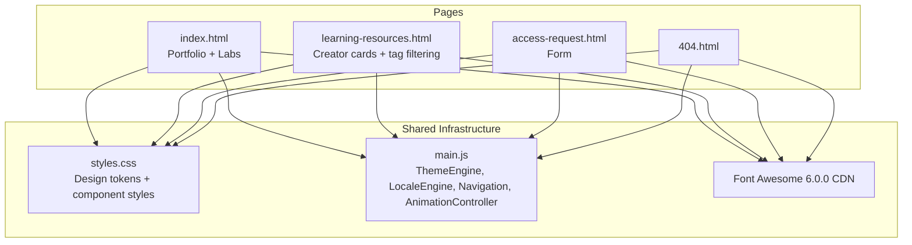

# Design Document: Site Bugfixes and Restructure

## Overview

This design addresses two categories of work: (1) bug fixes on `index.html` for the theme toggle icon, language switcher, resume button styling, certification badge, and broken links, and (2) a structural overhaul of `learning-resources.html` from a medium-based layout to a creator-based layout with topic tag filtering.

The site uses a shared `styles.css` and `main.js` architecture. All pages load Font Awesome 6.0.0 via CDN, use `ThemeEngine` for dark/light mode (via `data-theme` attribute on `<html>`), and use `LocaleEngine` for i18n (via `data-i18n` attributes and `PAGE_TRANSLATIONS` objects defined inline per page).

Key findings from codebase analysis:
- The theme toggle icon (`<i class="fas fa-moon">`) is static — `ThemeEngine.toggle()` changes the theme but never updates the icon class
- The language buttons call `LocaleEngine.setLocale()` which works, but the active button state is never visually updated after click
- The learning resources page has CSS classes (`.tab-btn`, `.tab-content`, `.resource-card`, `.resources-grid`) that are **not defined** in `styles.css` — the page renders unstyled
- There is **no JavaScript** for tab switching on the learning resources page
- The "View Resume" button uses `.btn--primary` which has no issue in CSS — the permanent highlight is likely caused by the link being `:visited` or a browser-specific focus retention issue

## Architecture



### Change Strategy

**Bug fixes (index.html):**
1. Modify `ThemeEngine.toggle()` in `main.js` to swap the icon class between `fa-moon` and `fa-sun` and update `ThemeEngine.init()` to set the correct initial icon
2. Add active-state management to `LocaleEngine` so the current language button gets a visual `.active` class
3. Fix the "View Resume" button permanent highlight via CSS specificity adjustment
4. Verify/update the Terraform badge Credly image URL
5. Audit all links on both pages

**Restructure (learning-resources.html):**
1. Add all missing CSS for tabs, resource cards, creator cards, platform cards, and tag filters to `styles.css`
2. Add tab switching and tag filtering JavaScript to `main.js`
3. Rewrite the HTML content from medium-based to creator-based layout
4. Deduplicate creators across categories

## Components and Interfaces

### 1. ThemeEngine Icon Sync (main.js modification)

The `toggle()` function needs to update the icon inside `.navbar__theme-toggle` after changing the theme. The `init()` function needs to set the correct initial icon based on the applied theme.

```javascript
// In ThemeEngine.toggle():
function toggle() {
    var current = getTheme();
    var next = current === DARK ? LIGHT : DARK;
    applyTheme(next);
    _storageSet(STORAGE_KEY, next);
    _manualOverride = true;
    _updateIcon(next);
}

function _updateIcon(theme) {
    var btn = document.querySelector('.navbar__theme-toggle i');
    if (!btn) return;
    if (theme === DARK) {
        btn.classList.replace('fa-moon', 'fa-sun');
    } else {
        btn.classList.replace('fa-sun', 'fa-moon');
    }
}

// In ThemeEngine.init(), after applyTheme():
_updateIcon(getTheme());
```

Exposed in the return object for testability: `_updateIcon`.

### 2. LocaleEngine Active Button State (main.js modification)

After `setLocale()` translates the page, it should also update the `.active` class on language buttons.

```javascript
// In LocaleEngine.setLocale():
function setLocale(locale) {
    if (SUPPORTED.indexOf(locale) === -1) {
        locale = DEFAULT_LOCALE;
    }
    _currentLocale = locale;
    _storageSet(STORAGE_KEY, locale);
    translate(locale);
    _updateActiveButton(locale);
}

function _updateActiveButton(locale) {
    var buttons = document.querySelectorAll('.navbar__lang-btn');
    for (var i = 0; i < buttons.length; i++) {
        var btn = buttons[i];
        if (btn.getAttribute('data-lang') === locale) {
            btn.classList.add('active');
        } else {
            btn.classList.remove('active');
        }
    }
}

// Also call _updateActiveButton in init() after translate():
_updateActiveButton(_currentLocale);
```

### 3. View Resume Button CSS Fix (styles.css modification)

The permanent highlight is caused by the `:visited` pseudo-class inheriting the primary button color, making it look always-highlighted. Add explicit `:visited` styling:

```css
.btn--primary:visited {
    background-color: var(--color-primary);
    color: #fff;
}
```

Also ensure no `:focus` style persists after click by using `:focus-visible` (already in place) rather than `:focus`.

### 4. Tab System (new module in main.js)

A new `TabSystem` module handles tab switching and integrates with tag filtering.

```javascript
const TabSystem = (function () {
    function init() {
        var tabButtons = document.querySelectorAll('.tab-btn');
        if (tabButtons.length === 0) return;

        for (var i = 0; i < tabButtons.length; i++) {
            tabButtons[i].addEventListener('click', _onTabClick);
        }
    }

    function _onTabClick(event) {
        var tabId = event.currentTarget.getAttribute('data-tab');
        activateTab(tabId);
    }

    function activateTab(tabId) {
        // Update buttons
        var buttons = document.querySelectorAll('.tab-btn');
        for (var i = 0; i < buttons.length; i++) {
            buttons[i].classList.toggle('active', buttons[i].getAttribute('data-tab') === tabId);
        }
        // Update content panels
        var panels = document.querySelectorAll('.tab-content');
        for (var j = 0; j < panels.length; j++) {
            panels[j].classList.toggle('active', panels[j].id === tabId + '-tab');
        }
    }

    return { init: init, activateTab: activateTab };
})();
```

### 5. Tag Filter System (new module in main.js)

A new `TagFilter` module provides client-side filtering of creator cards by topic tag within the active tab.

```javascript
const TagFilter = (function () {
    var _activeTag = null;

    function init() {
        var container = document.querySelector('.tag-filters');
        if (!container) return;
        container.addEventListener('click', _onTagClick);
    }

    function _onTagClick(event) {
        var btn = event.target.closest('.tag-filter-btn');
        if (!btn) return;
        var tag = btn.getAttribute('data-tag');

        if (_activeTag === tag) {
            _activeTag = null; // deselect
        } else {
            _activeTag = tag;
        }
        _updateFilterButtons();
        _filterCards();
    }

    function _filterCards() {
        var activePanel = document.querySelector('.tab-content.active');
        if (!activePanel) return;
        var cards = activePanel.querySelectorAll('.creator-card');
        for (var i = 0; i < cards.length; i++) {
            var tags = cards[i].getAttribute('data-tags') || '';
            if (!_activeTag || tags.indexOf(_activeTag) !== -1) {
                cards[i].style.display = '';
            } else {
                cards[i].style.display = 'none';
            }
        }
    }

    function _updateFilterButtons() {
        var buttons = document.querySelectorAll('.tag-filter-btn');
        for (var i = 0; i < buttons.length; i++) {
            buttons[i].classList.toggle('active', buttons[i].getAttribute('data-tag') === _activeTag);
        }
    }

    function getActiveTag() { return _activeTag; }

    function reset() { _activeTag = null; _updateFilterButtons(); _filterCards(); }

    return { init: init, getActiveTag: getActiveTag, reset: reset };
})();
```

### 6. Creator Card HTML Structure

Each creator gets one card with inline platform icons:

```html
<div class="creator-card" data-tags="aws,kubernetes,docker">
    <div class="creator-card__info">
        <h4 class="creator-card__name">TechWorld with Nana</h4>
        <p class="creator-card__meta">1M+ students</p>
    </div>
    <div class="creator-card__platforms">
        <a href="https://www.techworld-with-nana.com/" target="_blank" rel="noopener noreferrer" aria-label="Website" title="Website">
            <i class="fas fa-globe"></i>
        </a>
        <a href="https://www.youtube.com/@TechWorldwithNana" target="_blank" rel="noopener noreferrer" aria-label="YouTube" title="YouTube">
            <i class="fab fa-youtube"></i>
        </a>
        <a href="https://www.linkedin.com/in/nana-janashia/" target="_blank" rel="noopener noreferrer" aria-label="LinkedIn" title="LinkedIn">
            <i class="fab fa-linkedin"></i>
        </a>
    </div>
    <div class="creator-card__tags">
        <span class="skill-tag">AWS</span>
        <span class="skill-tag">Kubernetes</span>
        <span class="skill-tag">Docker</span>
    </div>
</div>
```

### 7. Platform Card HTML Structure (Independent Resources)

Platforms use a distinct card style:

```html
<div class="platform-card" data-tags="aws">
    <div class="platform-card__icon">
        <i class="fas fa-graduation-cap"></i>
    </div>
    <div class="platform-card__info">
        <h4 class="platform-card__name">AWS Skill Builder</h4>
        <p class="platform-card__meta">Official AWS Training</p>
    </div>
    <a href="https://skillbuilder.aws/" target="_blank" rel="noopener noreferrer" class="platform-card__link">
        Visit Platform →
    </a>
</div>
```

## Data Models

### Creator Data Structure

Each creator is represented as a JavaScript object for potential future data-driven rendering. For now, the data is embedded directly in HTML with `data-tags` attributes.

```
Creator {
    name: string           // Display name
    meta: string           // Short description (e.g., "1M+ students")
    platforms: {
        website?: string   // URL
        youtube?: string   // URL
        linkedin?: string  // URL
    }
    tags: string[]         // Topic tags (e.g., ["aws", "kubernetes"])
    category: string       // "cloud" | "devops" | "spanish"
}
```

### Platform Data Structure

```
Platform {
    name: string           // Display name
    meta: string           // Short description
    icon: string           // Font Awesome class (e.g., "fas fa-graduation-cap")
    url: string            // Platform URL
    tags: string[]         // Topic tags
}
```

### Tag Taxonomy

Fixed set of topic tags used for filtering:
- AWS, Kubernetes, Docker, Terraform, CI/CD, System Design, Linux, Azure, GCP


## Correctness Properties

*A property is a characteristic or behavior that should hold true across all valid executions of a system — essentially, a formal statement about what the system should do. Properties serve as the bridge between human-readable specifications and machine-verifiable correctness guarantees.*

### Property 1: Theme toggle icon reflects current theme

*For any* sequence of theme toggles, after each toggle the icon class inside `.navbar__theme-toggle` should be `fa-sun` when the theme is `dark` and `fa-moon` when the theme is `light`.

**Validates: Requirements 1.3**

### Property 2: Translation applies to all data-i18n elements

*For any* supported locale and any set of DOM elements with `data-i18n` attributes, after calling `setLocale(locale)`, every element whose `data-i18n` key exists in the translations object for that locale should have its `textContent` set to the corresponding translation value.

**Validates: Requirements 2.1**

### Property 3: Locale persistence round-trip

*For any* supported locale, storing it via `setLocale(locale)` and then re-initializing the `LocaleEngine` should result in `getLocale()` returning the same locale.

**Validates: Requirements 2.2, 2.3**

### Property 4: Active language button matches current locale

*For any* supported locale, after calling `setLocale(locale)`, exactly one `.navbar__lang-btn` element should have the `active` class, and its `data-lang` attribute should equal the selected locale.

**Validates: Requirements 2.4**

### Property 5: All certification badge images have meaningful alt text

*For any* `img.cert-badge` element on the page, the `alt` attribute should be a non-empty string.

**Validates: Requirements 4.2**

### Property 6: No duplicate creators within a category tab

*For any* category tab (Cloud, DevOps, Spanish), the set of creator names displayed within that tab should contain no duplicates.

**Validates: Requirements 6.1, 6.3**

### Property 7: Creator card completeness

*For any* `.creator-card` element, the card should contain a non-empty creator name, at least one platform link icon (website, YouTube, or LinkedIn), and at least one topic tag.

**Validates: Requirements 6.2, 7.1**

### Property 8: Platform links open in new tab

*For any* platform link (`<a>`) inside a `.creator-card__platforms` container, the link should have `target="_blank"` and `rel` containing `noopener` and `noreferrer`.

**Validates: Requirements 6.4**

### Property 9: Tag filtering shows only matching cards

*For any* active tag filter and any set of creator cards in the active tab, only cards whose `data-tags` attribute contains the selected tag should be visible (not `display: none`), and all other cards should be hidden.

**Validates: Requirements 7.2**

### Property 10: Tag filter toggle restores all cards

*For any* tag, clicking the tag filter to activate it and then clicking it again to deactivate should result in all creator cards in the active tab being visible.

**Validates: Requirements 7.3**

### Property 11: Tab switching shows correct content

*For any* tab button click, exactly one `.tab-content` panel should have the `active` class (the one matching the clicked tab's `data-tab` attribute), and the clicked `.tab-btn` should have the `active` class while all other tab buttons do not.

**Validates: Requirements 8.1, 8.3**

### Property 12: Tab state preserved during tag filtering

*For any* active tab and any tag filter action (activate or deactivate), the active tab should remain unchanged after the filter operation.

**Validates: Requirements 8.4**

## Error Handling

### Theme Toggle
- If the `.navbar__theme-toggle i` element is not found, `_updateIcon` silently returns without error
- If `localStorage` is unavailable, theme defaults to OS preference (existing behavior)

### Locale Engine
- If a language button references an unsupported locale, `setLocale` falls back to `'en'`
- If `PAGE_TRANSLATIONS` is missing or doesn't contain the requested locale, `translate()` returns without modifying the DOM
- If `localStorage` is unavailable, locale detection falls back to `navigator.language`

### Tab System
- If no `.tab-btn` elements exist on the page, `TabSystem.init()` returns immediately (no-op on non-resource pages)
- If a `data-tab` value doesn't match any `.tab-content` id, no panel is shown (graceful degradation)

### Tag Filter
- If no `.tag-filters` container exists, `TagFilter.init()` returns immediately
- If a card has no `data-tags` attribute, it is treated as having no tags and will be hidden when any filter is active
- Clicking a tag filter when no cards match shows an empty state within the tab

### Certification Badges
- All `` elements for badges include `alt` text so screen readers and broken-image states provide meaningful information
- `loading="lazy"` is used to prevent blocking page load if an image URL is slow

### Links
- All external links use `target="_blank"` with `rel="noopener noreferrer"` to prevent tab-napping
- Broken links identified during audit will be updated or removed before deployment

## Testing Strategy

### Dual Testing Approach

This feature uses both unit tests and property-based tests:

- **Unit tests**: Verify specific examples like initial page load state, specific tab clicks, specific badge alt text values, and edge cases
- **Property tests**: Verify universal properties across generated inputs (theme toggle sequences, locale round-trips, tag filtering correctness, tab switching invariants)

### Property-Based Testing Configuration

- **Library**: `fast-check` (already installed in the project as a dependency)
- **Minimum iterations**: 100 per property test
- **Tag format**: `Feature: site-bugfixes-and-restructure, Property {number}: {title}`
- Each correctness property maps to a single property-based test

### Test File Organization

- `tests/theme-icon-sync.property.test.js` — Property 1 (theme toggle icon)
- `tests/locale-translation.property.test.js` — Properties 2, 3, 4 (locale engine)
- `tests/badge-alt-text.property.test.js` — Property 5 (badge alt text)
- `tests/creator-cards.property.test.js` — Properties 6, 7, 8 (creator card structure)
- `tests/tag-filter.property.test.js` — Properties 9, 10, 12 (tag filtering)
- `tests/tab-system.property.test.js` — Property 11 (tab switching)

### Unit Test Coverage

Unit tests should cover:
- Theme toggle icon shows moon on light mode load, sun on dark mode load (Requirements 1.1, 1.2)
- First tab is active on page load (Requirement 8.2)
- Independent tab uses `platform-card` class not `creator-card` (Requirement 9.1)
- Specific broken link verification (Requirements 5.1, 5.2)
- Specific Credly badge URL validity (Requirement 4.1, 4.3)
