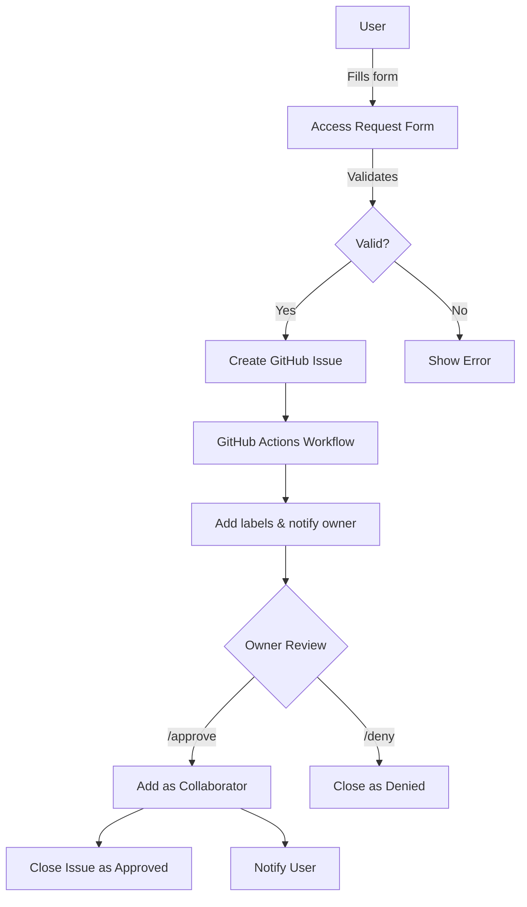

# Cloud DevOps and System Design Labs Website Documentation

This documentation provides a comprehensive overview of the Cloud DevOps and System Design Labs website project, including its structure, components, workflows, and purpose.

## Table of Contents

1. [Project Overview](#project-overview)
2. [Website Structure](#website-structure)
3. [Key Features](#key-features)
4. [Repository Access Workflow](#repository-access-workflow)
5. [Technical Implementation](#technical-implementation)
6. [Maintenance and Updates](#maintenance-and-updates)

## Project Overview

The Cloud DevOps and System Design Labs website serves as a central hub for Alex Garcia's educational resources related to cloud architecture, DevOps practices, and system design. The website provides:

- Professional profile and background information
- Links to educational lab repositories organized by difficulty level
- Certification showcase
- Access request system for private repositories
- Multilingual support (English, Spanish, Portuguese)

### Purpose

The primary purposes of this website are:

1. **Educational Resource Hub**: Centralize access to cloud and DevOps educational materials
2. **Professional Portfolio**: Showcase professional experience and certifications
3. **Repository Access Management**: Streamline the process for granting access to private lab repositories
4. **Student Engagement**: Provide a professional interface for students to access course materials

## Website Structure

The website consists of the following main components:

```
cloud-devops-labs-index/
├── index.html              # Main website page
├── access-request.html     # Repository access request form
├── learning-resources.html # Learning resources page
├── 404.html                # Custom 404 error page
├── styles.css              # Shared design system stylesheet (linked from all pages)
├── main.js                 # Shared JavaScript module (theme, locale, navigation, animations)
├── sitemap.xml             # SEO sitemap
├── robots.txt              # Crawler directives
├── docs/                   # Documentation directory
│   └── README.md           # This documentation file
├── .github/
│   ├── ISSUE_TEMPLATE/     # GitHub issue templates
│   │   └── access-request.yml  # Template for access requests
│   └── workflows/          # GitHub Actions workflows
│       └── access-request.yml  # Workflow for processing access requests
```

### Page Structure

The main `index.html` page is organized into the following sections:

1. **Header**: Name, title, and social links
2. **About Me**: Professional background and skills
3. **Experience**: Work history and professional experience
4. **Certifications**: AWS and other professional certifications
5. **Cloud DevOps and System Design Labs**: Links to repositories organized by difficulty level
6. **Footer**: Copyright information and disclaimer

## Key Features

### Responsive Design

The website is fully responsive and adapts to different screen sizes:
- Desktop: Full layout with multi-column sections
- Tablet: Adjusted layout with some single-column sections
- Mobile: Streamlined single-column layout with adjusted font sizes and spacing

### Dark/Light Mode

- Automatic detection of system preference via `prefers-color-scheme`
- Manual toggle with localStorage persistence
- Theme applied via `data-theme` attribute on `<html>` using CSS custom properties
- Light and dark palettes defined as design tokens in `styles.css`

### Multilingual Support

- Language selector in the top-left corner
- Support for three languages:
  - English (EN)
  - Spanish (ES)
  - Portuguese (PT)
- All content is translated, including form fields and buttons
- Language preference is saved in localStorage

### Repository Access System

- Custom form for requesting access to private repositories
- GitHub-based workflow for processing access requests
- Automated collaborator addition upon approval

## Repository Access Workflow

The repository access system follows this workflow:

1. **User Submits Request**:
   - User fills out the access request form on `access-request.html`
   - Form validates email format and GitHub username existence
   - Form creates a GitHub issue with the request details

2. **Issue Creation**:
   - GitHub issue is created with standardized format
   - Issue is labeled with "access-request" and "pending-approval"
   - Issue is assigned to repository owner

3. **Review Process**:
   - Repository owner receives notification of new access request
   - Owner reviews request details in the GitHub issue
   - Owner approves or denies with simple commands

4. **Access Granting**:
   - Upon approval, GitHub Actions workflow adds user as collaborator
   - User receives notification of access being granted
   - Issue is closed and labeled as "approved"

5. **Denial Process**:
   - If denied, issue is closed and labeled as "denied"
   - User receives notification of denial

### Workflow Diagram



## Technical Implementation

### Front-End Technologies

- **HTML5**: Semantic structure and content
- **CSS3**: Styling with custom properties for theming
- **JavaScript**: Interactive features and form handling
- **Font Awesome**: Icons for social links and UI elements

### GitHub Integration

- **GitHub Pages**: Hosting the static website
- **GitHub Issues**: Managing access requests
- **GitHub Actions**: Automating the access granting process

### Automation

- **GitHub Actions Workflow**: Processes access requests and adds collaborators
- **Issue Templates**: Standardizes the format of access requests
- **Form Validation**: Ensures data quality before submission

## Maintenance and Updates

### Adding New Labs

To add new lab repositories:

1. Create the new repository on GitHub
2. Update the project cards in `index.html`
3. Add the repository to the dropdown options in:
   - `access-request.html`
   - `.github/ISSUE_TEMPLATE/access-request.yml`

### Adding New Languages

To add support for a new language:

1. Add a new language button in the language selector
2. Add translations to the `translations` object in both HTML files
3. Update the `translatePage` function to handle any language-specific elements

### Updating Styles

All styles are defined in the shared `styles.css` file using CSS custom properties (design tokens). To update styles:

1. Edit the design tokens in `:root` (light theme) or `[data-theme="dark"]` (dark theme) in `styles.css`
2. Changes automatically apply to all pages that link the shared stylesheet
