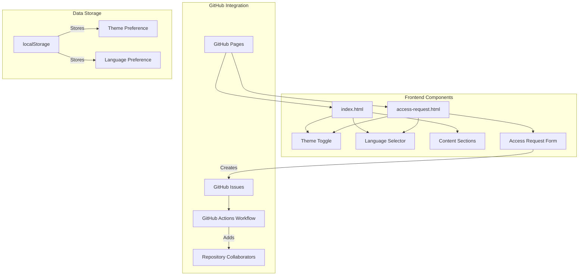
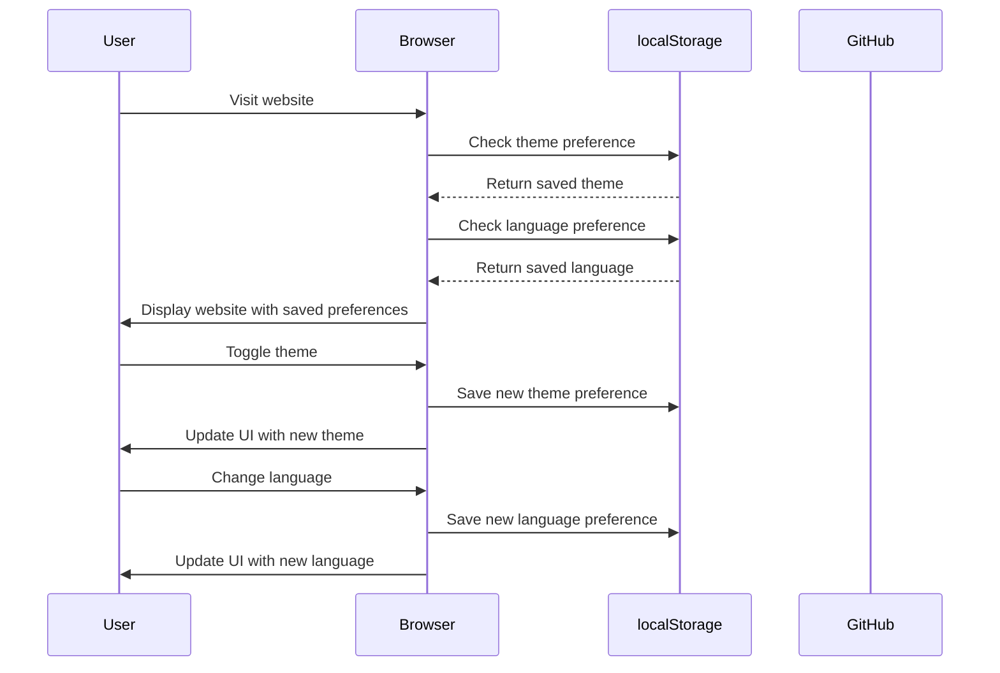
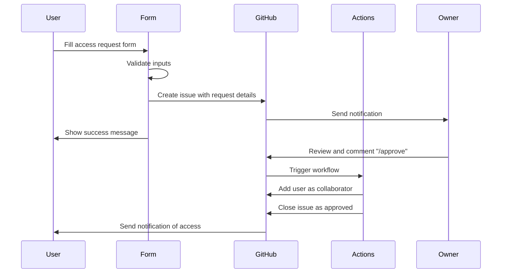

# Website Architecture and Technical Details

This document provides a detailed technical overview of the Cloud DevOps and System Design Labs website architecture, including component interactions, data flow, and implementation details.

## Architecture Overview

The website follows a static site architecture hosted on GitHub Pages with dynamic features implemented through client-side JavaScript and GitHub Actions for backend processes.

### Component Diagram



## Frontend Implementation

### Responsive Design Implementation

The responsive design is implemented using:

1. **Fluid Layouts**: Using relative units and percentages
2. **CSS Grid and Flexbox**: For flexible content arrangement
3. **Media Queries**: Targeting different screen sizes
   - `@media (max-width: 768px)`: Tablet and smaller devices
   - `@media (max-width: 480px)`: Mobile devices

### Theme Switching Logic

The theme switching functionality works as follows:

1. **Initial Theme Detection**:
   ```javascript
   const prefersDarkScheme = window.matchMedia('(prefers-color-scheme: dark)');
   
   if (localStorage.getItem('theme') === 'dark' || 
       (!localStorage.getItem('theme') && prefersDarkScheme.matches)) {
       document.body.classList.add('dark-mode');
       themeIcon.classList.replace('fa-moon', 'fa-sun');
   }
   ```

2. **Theme Toggle Handler**:
   ```javascript
   themeToggle.addEventListener('click', () => {
       document.body.classList.toggle('dark-mode');
       
       if (document.body.classList.contains('dark-mode')) {
           localStorage.setItem('theme', 'dark');
           themeIcon.classList.replace('fa-moon', 'fa-sun');
       } else {
           localStorage.setItem('theme', 'light');
           themeIcon.classList.replace('fa-sun', 'fa-moon');
       }
   });
   ```

### Language Switching Implementation

The language switching system uses:

1. **Translation Data**: JSON objects containing translations for all UI elements
2. **Language Selector**: Buttons that trigger language changes
3. **DOM Manipulation**: Functions that update text content based on selected language
4. **Persistence**: localStorage to remember user language preference

## Backend Processes

### GitHub Actions Workflow

The GitHub Actions workflow for processing access requests consists of three main jobs:

1. **process-access-request**: Triggered when a new issue with [ACCESS REQUEST] in the title is created
   - Parses the issue body to extract request details
   - Adds a comment with approval options
   - Adds appropriate labels

2. **process-approval**: Triggered when a comment containing `/approve` is added
   - Adds the user as a collaborator to the specified repository
   - Updates the issue with success message
   - Closes the issue with "approved" label

3. **process-denial**: Triggered when a comment containing `/deny` is added
   - Adds a denial comment to the issue
   - Closes the issue with "denied" label

### Access Request Form Processing

The form submission process:

1. Validates input fields (email format, GitHub username existence)
2. Creates a GitHub issue with standardized format
3. Sends an email notification with issue details
4. Shows success message to the user

## Data Flow

### User Session Data Flow



### Access Request Data Flow



## Security Considerations

### Form Validation

The access request form implements several validation measures:

1. **Required Fields**: All critical fields are marked as required
2. **Email Format Validation**: Ensures valid email format using regex
3. **GitHub Username Validation**: Verifies username exists via GitHub API

### GitHub Actions Security

The GitHub Actions workflow includes security measures:

1. **Permission Scoping**: Limited permissions for each job
2. **Personal Access Token**: Secure token for repository operations
3. **Input Validation**: Parsing and validation of issue content

## Performance Optimization

### Current Optimizations

1. **Minimal Dependencies**: Limited use of external libraries
2. **Efficient DOM Manipulation**: Targeted updates rather than full page reloads
3. **Lazy Loading**: Images and resources load as needed

### Future Optimization Opportunities

1. **CSS Optimization**: Move styles to external stylesheet
2. **Image Optimization**: Further compress and optimize images
3. **Caching Strategies**: Implement better caching for static resources

## Testing Procedures

To test the website functionality:

1. **Responsive Testing**: Test on multiple device sizes
2. **Theme Toggle Testing**: Verify theme changes correctly
3. **Language Switch Testing**: Confirm all content translates properly
4. **Form Validation Testing**: Test with valid and invalid inputs
5. **Access Request Testing**: Verify end-to-end workflow functions

## Deployment Process

The website is deployed through GitHub Pages with the following process:

1. Changes are committed to the main branch
2. Repository is temporarily made private during updates
3. Changes are pushed to GitHub
4. Repository is made public again
5. GitHub Pages automatically builds and deploys the site

This process ensures that users don't see partially updated content during deployments.
